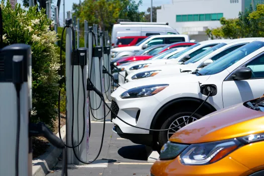

# Electric Vehicle Adoption and Infrastructure Disparities in California

**CS 163 Capstone Project · San Jose State University · Spring 2026**

Explore the full interactive dashboard → [live website](https://sp26-project-491005.wm.r.appspot.com)



---

## Overview

California is undergoing a large-scale transition toward electric vehicles, with statewide goals aimed at reducing emissions and expanding clean transportation. However, EV adoption and public charging infrastructure are not evenly distributed across communities. Socioeconomic conditions, housing characteristics, environmental disadvantage, and infrastructure availability all shape which communities adopt EVs quickly and which fall behind.

This project analyzes EV adoption and community-level disparities across California ZIP codes. Using vehicle registration data, census demographics, environmental justice indicators, and public charging station records, we construct a unified ZIP-code-level dataset covering 1,800+ ZIP codes and 34 features. The project spans exploratory data analysis, regression modeling, and six machine learning experiments — all presented through an interactive web dashboard.

---

## Research Questions

1. How are EV adoption rates associated with income, education, housing value, and homeownership? We expected communities with higher income, education, home values, and homeownership to show significantly higher adoption, while those with greater socioeconomic vulnerability and environmental burden lag behind.

2. Do structural socioeconomic factors explain the disparity that appears across racial and ethnic composition? Once income, education, and housing value are accounted for, we expected race and ethnicity effects to decrease substantially — pointing to structural economic differences rather than race itself as the primary driver.

3. Is the relationship between income and EV adoption nonlinear? We expected adoption to accelerate sharply beyond a certain income level rather than rising evenly — behaving more like a luxury good, where affordability barriers create threshold effects.

4. Is charging infrastructure distributed unevenly across California ZIP codes, and does it interact with socioeconomic conditions? Higher-income, higher-adoption ZIP codes were expected to have significantly more charging infrastructure, with lower-infrastructure areas concentrated in more disadvantaged communities.

5. Do communities with greater environmental burden show lower EV adoption? We expected areas with higher pollution exposure and socioeconomic disadvantage to be the least likely to benefit from the clean transportation transition.

---

## Broader Impact

Understanding who adopts clean technologies — and who has access to the infrastructure that supports them — is critical for ensuring that climate transitions do not unintentionally reinforce existing inequalities. If EV adoption and charging access remain concentrated in wealthier, structurally advantaged communities, the environmental and economic benefits of electrification will not be equitably distributed.

This project provides value to multiple audiences. Policymakers and planners can use this analytical approach to identify communities where EV adoption or charging access lags and consider targeted incentives, infrastructure investment, or outreach programs. Environmental justice researchers gain a clearer picture of how transportation electrification intersects with existing socioeconomic and pollution disparities. More broadly, this project demonstrates how data-driven analysis can improve transparency around technology adoption patterns and support more equity-focused policy discussions as California advances its clean transportation goals.

---

## ⚙️ Tech Stack

| Layer | Tools |
|---|---|
| Data collection | Python, Census API, NREL Alt Fuel Stations API |
| Data processing | Pandas |
| Modeling | Scikit-learn (Ridge Regression, Random Forest, Logistic Regression) |
| Web framework | Plotly Dash + Flask |
| Styling | Custom CSS (light/dark theme, CSS variables) |
| Deployment | Google App Engine, Gunicorn, Google Cloud Storage |
| Version control | Git + GitHub |

---

## 📦 Data Sources

All datasets are publicly available and integrated at the ZIP code level.

| Source | What it provides | Geographic level |
|---|---|---|
| [**CalMatters EV Dataset**](https://calmatters.org/environment/2023/03/california-electric-cars-demographics/) | ZIP-level EV registration data from the California DMV, including vehicle counts by fuel type, EV adoption rate, income, race/ethnicity, educational attainment, and Zillow Home Value Index | ZIP code |
| [**American Community Survey (ACS) 5-Year Estimates**](https://www.census.gov/data/developers/data-sets/acs-5year.html) | Socioeconomic and housing variables: Gini index, housing tenure, housing structure type, poverty status, vehicle availability — retrieved via Census API | ZCTA |
| [**CalEnviroScreen 4.0**](https://oehha.ca.gov/calenviroscreen) | Environmental burden indicators (CES composite score, pollution burden, traffic exposure) developed by California's OEHHA, identifying communities disproportionately burdened by pollution | Census tract |
| [**NREL Alternative Fuel Stations API**](https://developer.nrel.gov/docs/transportation/alt-fuel-stations-v1/) | Public EV charging station locations, port counts, Level 2 and DC Fast infrastructure — filtered to operational California stations as of end of 2021 | Point location → ZIP |

**Citations:**

Lopez, Nadia, and Erica Yee. "Who Buys Electric Cars in California — and Who Doesn't?" *CalMatters*, 22 Mar. 2023, calmatters.org/environment/2023/03/california-electric-cars-demographics/.

U.S. Census Bureau. *American Community Survey 5-Year Estimates (2023)*. Accessed via Census API. census.gov/data/developers/data-sets/acs-5year.html

California Office of Environmental Health Hazard Assessment. *CalEnviroScreen 4.0*. oehha.ca.gov/calenviroscreen. Accessed 12 Dec. 2025.

National Renewable Energy Laboratory. *Alternative Fuel Stations API*. developer.nrel.gov/docs/transportation/alt-fuel-stations-v1/

---

## 🔄 Data Pipeline

Four sources were acquired, cleaned, and merged into a single ZIP-level analytical table.

```
CalMatters EV Data  →  ACS Feature Construction  →  CalEnviroScreen Aggregation  →  NREL Infrastructure
      (base)              (Census API, ZCTA)          (tract → ZIP, pop-weighted)     (point → ZIP)
                                                                 ↓
                                         Final Dataset: 1,800+ ZIP codes × 34 features
```

Key decisions:
- ZIP code as the universal merge key across all sources
- ACS counts converted to normalized shares: renter share, multi-unit share, poverty share
- CalEnviroScreen tract-level data aggregated to ZIP using population-weighted averages — where tract and ZIP boundaries don't align well, this introduces some geographic imprecision
- Charging ZIPs with no matched stations filled with zero after the merge
- Derived features engineered post-merge: `RenterShare`, `MultiUnitShare`, `HomeownerShare`, `PortsPer10kPeople`, `ChargersPer1000EV`

---

## 🤖 Modeling

Six machine learning models were developed to answer distinct questions about EV adoption. Full model details, feature importance charts, and coefficient plots are in the [ML section of the website](https://sp26-project-491005.wm.r.appspot.com/ml).

| # | Model | Approach | Question |
|---|---|---|---|
| 1 | EV Adoption Prediction | Ridge Regression + Random Forest | Which structural factors most predict EV adoption? |
| 2 | Income × Infrastructure Interaction | Ridge w/ Interaction Term | Does infrastructure help all income groups equally? |
| 3 | EV Desert Classification | Logistic Regression + RF Classifier | Who is left behind in the EV transition? |
| 4 | Infrastructure Desert Classification | Logistic Regression + RF Classifier | Who lacks access to public charging? |
| 5 | Adoption Pathway Model | Ridge Regression + Random Forest | Are plug-in hybrids a stepping stone to full EVs? |
| 6 | High-Income Subset Analysis | Ridge Regression | Within wealthy areas, what still explains variation? |

---

## 💡 Key Findings

1. **Education is the strongest predictor.** Educational attainment has a stronger association with EV adoption than income — consistent across every model we ran.
2. **Socioeconomic advantage structures adoption.** Home value and household income follow closely. EV adoption tracks the geography of economic and educational privilege.
3. **Environmental burden works the other way.** Communities with higher pollution burden and poverty rates adopt EVs at lower rates — the places that could benefit most from clean transportation are the furthest behind.
4. **Infrastructure helps, but not equally.** Charging access is positively associated with adoption, but the benefit is strongest in higher-income areas. Infrastructure can widen gaps rather than close them.
5. **EV deserts are highly predictable.** The bottom 20% of ZIP codes by adoption cluster tightly around structural disadvantage. They are not randomly distributed.
6. **Charging deserts follow a different logic.** Infrastructure-poor ZIP codes are far harder to classify — charger placement reflects private investment and policy decisions more than community need.
7. **Plug-in hybrids signal transition readiness.** PHEV share is the single strongest behavioral predictor of full EV adoption. Communities familiar with plug-in vehicles are far more likely to transition.
8. **Income's effect is nonlinear.** EV adoption accelerates sharply above certain income thresholds — lower-income communities face compounding barriers, not just a linear disadvantage.

---

## 📁 Project Structure

```
EV_Analysis-CS163Capstone/
├── appengine/
│   ├── app.py                  # Dash app, navbar, dark/light theme toggle
│   ├── app.yaml                # App Engine deployment config
│   ├── requirements.txt
│   ├── assets/
│   │   ├── style.css           # Full custom stylesheet (light + dark themes)
│   │   └── images/             # Contributor photos
│   ├── pages/
│   │   ├── home.py             # Landing page
│   │   ├── data.py             # Data sources and pipeline
│   │   ├── eda.py              # Exploratory data analysis
│   │   ├── analysis.py         # Regression and structural analysis
│   │   ├── ml.py               # Interactive ML model explorer
│   │   └── findings.py         # Key findings, implications, limitations
│   ├── static/images/          # Visualization exports
│   └── data/final.csv          # Final integrated dataset
├── eda_analysis.ipynb          # Full EDA and modeling notebook
├── get_data.ipynb              # Data acquisition notebook
└── docs/ProjectProposal.pdf
```

---

## Running Locally

```bash
cd appengine
pip install -r requirements.txt
python app.py
# → http://127.0.0.1:8050
```

---

## Limitations

- **Cross-sectional data only** — associations are observable but causal direction cannot be established.
- **ZIP code aggregation** — a single ZIP can contain very different neighborhoods; within-ZIP variation is invisible to the model.
- **Geographic level mismatch** — EV and demographic data are at the ZIP level; CalEnviroScreen is at the census tract level. Population-weighted aggregation introduces noise where boundaries don't align.
- **Unobserved variables** — consumer attitudes, dealership proximity, utility electricity rates, and local EV model availability are not captured.
- **2021 snapshot** — EV prices have fallen and infrastructure has expanded significantly since then; structural patterns may be shifting.

---

## 👩‍💻 Authors

### Samriddhi Matharu


B.S. Data Science, San Jose State University ('26)

Samriddhi has experience across data, software, and product roles and holds leadership positions in technical consulting on campus. She is passionate about responsible computing and using data to surface equity patterns that aggregate statistics miss. On this project, she led the data pipeline, exploratory analysis, machine learning modeling, and end-to-end web application development.

### Bhavya Vatsavayi


B.S. Data Science, San Jose State University ('26)

Bhavya has experience across data analytics, BI, and ML focused roles. She holds leadership roles in research, analytics and excel.
For this project, led the data pipeline, exploratory analysis, and further analysis to support the development and validation of the machine learning model and its findings.
maybe this picture

---

*CS 163 Capstone · San Jose State University · Spring 2026*
